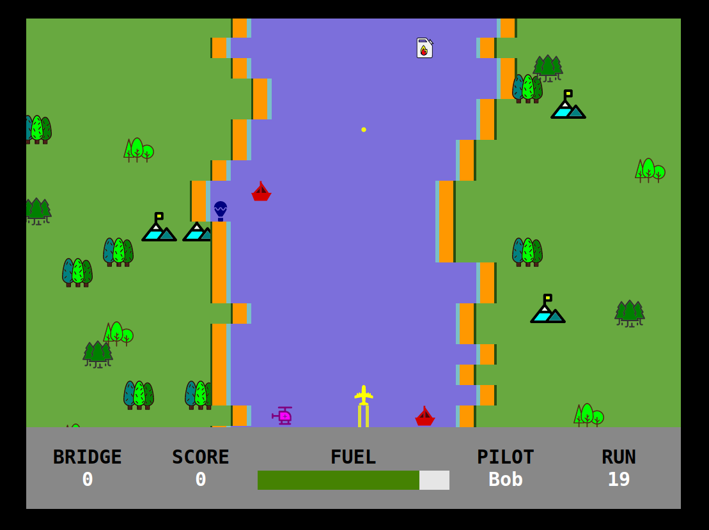

# 

# River Rogue | Legacy Raid
   A ( rather simple ) tribute to River Raid (**== best game ever made ==**) using native web technologies I created for the #devember 2021 challenge

## Demo
Here is a working live demo : https://notbigmuzzy.github.io/riveraid/

### Used
- [Sound pack | freesound.org](https://freesound.org/people/LittleRobotSoundFactory/packs/16681/)
- [Main music theme | fesliyanstudios.com](https://www.fesliyanstudios.com/)
- [jQuery](http://www.w3schools.com/jquery/jquery_ref_ajax.asp) - jQuery simplifies HTML document traversing, event handling, animating, and Ajax interactions for rapid web development

## Known bugs - TODO
- Improve scrolling animation
- Improve Graphics
- Responsive
- Sometimes river meandering spawns unpassable terrain	

## History
   The original game was created in the 82/83 by [Carol Shaw](https://en.wikipedia.org/wiki/Carol_Shaw), here's a great short documentary about the subject - [LINK](https://www.youtube.com/watch?v=1OcT5zJzVV0) and is, incidentally, first video game I ever played, on an C64C which my parents bought in 1989.

## License
MIT © [NBM](http://notbigmuzzy.github.io/)